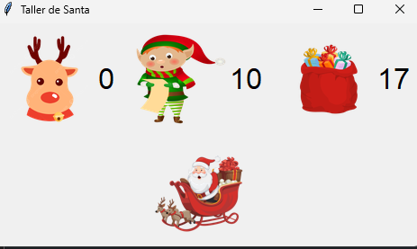

# ¿Cuál decidi resolver?
Decidi resolver el problema de santa
# ¿Cómo se compila el programa?
Utilize un entorno Windows (11) y el lenguaje de programacion Python, ademas para la interfaz grafica se usan las siguientes bibliotecas: Tkinter y pillow, que se instalan en python segun los siguientes comandos:
```
sudo apt-get install python3-tk
pip install Pillow
```
# ¿Qué estrategia de sincroniazcion me funciono?
En este caso yo use variables de condicion, donde segun que estas se despertaban, por ejemplo santa al ser el recurso compartido se usa una variable de condicion en donde si 3 elfos estan en problemas le piden ayuda y lo despiertan con un notify o si los renos estan listos lo despiertan, ademas uso varios Mutex unicamente con el fin de proteger las variables a las que accedor para no perder datos
# ¿Refinamiento?
Este problema no tenia refinamiento (no lo escogi a posta, fue el primero que llamo mi atencion y me di cuenta que los refinamientos estaban indicados en los problemas ya cuando casi terminaba con este haha)

# ¿Dudas?
El siguiente bloque de codigo:
```
def __Despertando__(self): #Funcion de inicio de santa
        global RenosListos #Toma los renos que esten listos
        with SantaVC: #Toma la variable de condicion
            self.__duerme__() #Y se duerme a la espera de que alguien lo despierte
            #Cuando sucede un notify se despierta y evalua su entorno?
            if(RenosListos == 9): #Ah con que fueron ustedes Renos
                santa_label.config(image=santa_renos_photo)
                self.__FelizNavidad__()
        #Si fueron entonces aprovecha que esta despierto y dice, a ver elfos ocupan ayuda?
        MutexSantaDisp.acquire()
        global ElfosEnProblemas
        ElfosEnProblemascache = ElfosEnProblemas
        MutexSantaDisp.release()
        if(ElfosEnProblemascache>=3): # si son 3 es porque los elfos ocupan ayuda, se hace fuera del bloque SantaVC por la razon prinicpal de que, si los renos siempre estan listos
                                      #Entonces no los elfos sufririan de inanicion, fuera del bloque se garantiza que una vez pasados los renos, santa aprovecha y ayuda a los elfos
                                      #Pues sin juguetes no hay navidad
                                      #Tambien se hace asi porque si los renos no fueron quien alertaron a santa entonces automaticamente dice Ah fueron los elfos, no us eun elif pq
                                      #Si entra al SantaVC la variable "Elfos en problemas" se bloquearia hasta que santa termine de ayudar a los elfos y pues, los elfos en problemas
                                      #no se actualizarian correctamente.
                                      #Aqui tengo un poco de duda en si esto es trampa pq pues tengo que revisar el estado de cuantos elfos hay en problemas
                                      #Pero pues el planteamiento me parece indicar que siempre tengo que estar al pendiente de cuantos elfos hay en problemas y cuantos renos hay listos.
            santa_label.config(image=santa_awake_photo) # Actualizacion de la GUI
            self.__OcupadoConElfos__() #Se ocupa de los elfos en problemas
```
¿Cuenta como verificacion de estado con condicionales?, yo diria que no, porque santa no esta preguntando constantemente si hay elfos en duda o si hay renos listos, Santa se despierta y evalua su entorno, es como si se levantara y viera si lo desperto un Reno o un Elfo.
# Ejecucion
El programa tiene impresion de texto en consola para ver lo que hace cada elfo, los renos que estan listos y cuantos faltan, si ya es navidad, etc. vaya todo lo que se puede ver en la GUI se puede ver en la consola de comandos, pero la GUI muestra con más claridad lo que sucede (De hecho me ayudo a encontrar varios errores), y algo extra es que cuando santa esta en la navidad muestra una imagen de el en sus renos, cuando ayuda a los elfos una imagen de el despierto y cuando duerme una imagen de el dormido, pongo un ejemplo a continuacion donde santa esta dando la feliz navidad:

